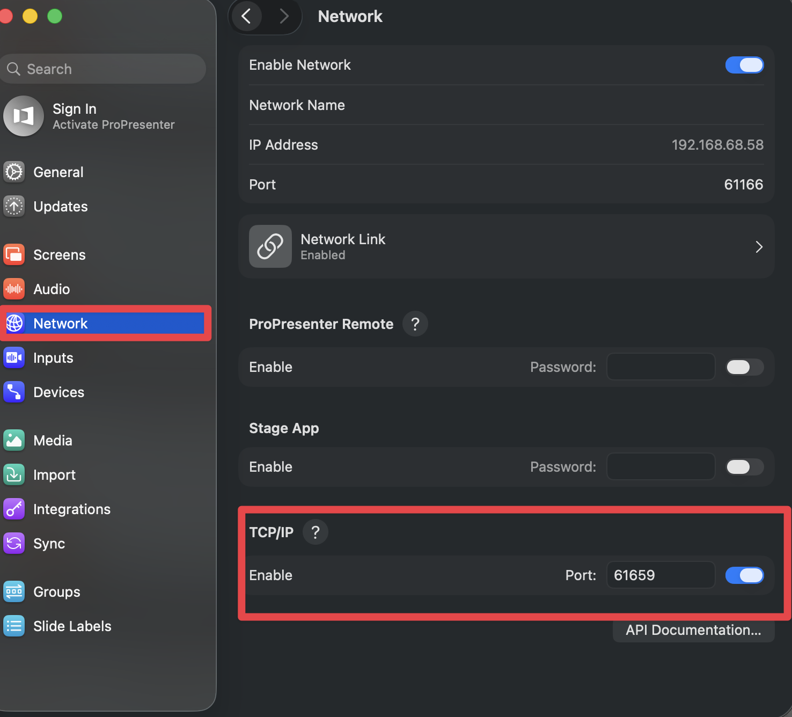

# Getting Started

[← Back to Home](./index.md)

---

Get ProPresenter Lyrics Export up and running in just a few minutes.

## Table of Contents

1. [Configure ProPresenter First](#critical-configure-propresenter-first) ⚠️
2. [Installation](#installation)
3. [Next Steps](#next-steps)
4. [Troubleshooting](#troubleshooting-setup)

---

## ⚠️ CRITICAL: Configure ProPresenter First

**Before installing or using this tool, you MUST configure ProPresenter correctly. Nothing will work without this step.**

### Enable Network API in ProPresenter

1. Open **ProPresenter 7**
2. Go to **Preferences** (or **ProPresenter** → **Preferences** on macOS)
3. Click the **Network** tab
4. Check the box: **"Enable Network API"**
5. Note the **Port** number (default: `1025`)
6. If connecting from another computer, note the **IP address** displayed
7. Click **OK** or **Save**
8. **Restart ProPresenter** for changes to take effect



**Why this matters:** ProPresenter's Network API is how this tool communicates with ProPresenter. Without it enabled, the tool cannot connect, read playlists, or export lyrics.

**Connection details you'll need:**
- **Host**: `127.0.0.1` (same computer) or the IP address shown in ProPresenter (remote computer)
- **Port**: `1025` (default) or whatever port is shown in ProPresenter's Network settings

---

## Installation

---

### 🖥️ Desktop App (Recommended)

The easiest way to get started with a full graphical interface.

**Download:**
- Go to [GitHub Releases](https://github.com/adamswbrown/propresenterlyricexport/releases)
- Download the latest version for your platform:
  - **macOS**: `ProPresenter-Lyrics-vX.Y.Z-mac.zip`
  - **Windows**: `ProPresenter-Lyrics-vX.Y.Z-win.exe`

**macOS Installation:**
```bash
# 1. Unzip the downloaded file
unzip ProPresenter-Lyrics-vX.Y.Z-mac.zip

# 2. Fix Gatekeeper (one-time)
xattr -cr "/path/to/ProPresenter Lyrics.app"

# 3. Move to Applications
mv ProPresenter\ Lyrics.app /Applications/

# 4. Launch the app
open /Applications/ProPresenter\ Lyrics.app
```

**Windows Installation:**
1. Run the installer (`.exe`)
2. Follow the installation wizard
3. Launch "ProPresenter Lyrics" from your Start menu

**First Run:**
1. Open the app
2. Enter your ProPresenter **host** and **port**
3. Click **"Connect & Load Playlists"**
4. Browse your playlists and export!

---

### 💻 CLI Executables (Advanced Users)

Lightweight standalone binaries for power users and automation.

**Download:**
- Go to [GitHub Releases](https://github.com/adamswbrown/propresenterlyricexport/releases)
- Download for your platform:
  - **macOS (Intel)**: `propresenter-lyrics-macos-x64`
  - **macOS (Apple Silicon)**: `propresenter-lyrics-macos-arm64`
  - **Windows**: `propresenter-lyrics-win-x64.exe`

**macOS Setup:**
```bash
# Make executable
chmod +x propresenter-lyrics-macos-x64

# Test connection
./propresenter-lyrics-macos-x64 status
```

**Windows Setup:**
```bash
# Test connection
propresenter-lyrics-win-x64.exe status
```

**Environment Variables (Optional):**
```bash
# macOS/Linux
export PROPRESENTER_HOST=192.168.1.100
export PROPRESENTER_PORT=1025

# Windows (PowerShell)
$env:PROPRESENTER_HOST='192.168.1.100'
$env:PROPRESENTER_PORT='1025'
```

### 🌐 Web Proxy App (Remote Access)

A menu bar app that lets remote users access ProPresenter Lyrics Export from any browser, anywhere in the world — secured with Google OAuth and Cloudflare Tunnel.

**Download:**
- Go to [GitHub Releases](https://github.com/adamswbrown/propresenterlyricexport/releases)
- Download the **Web Proxy** for your platform:
  - **macOS**: `ProPresenter-WebProxy-vX.Y.Z-mac.zip`

**macOS Installation:**
```bash
# 1. Unzip
unzip ProPresenter-WebProxy-vX.Y.Z-mac.zip

# 2. Fix Gatekeeper (one-time)
xattr -cr "ProPresenter Web Proxy.app"

# 3. Move to Applications
mv "ProPresenter Web Proxy.app" /Applications/

# 4. Launch — appears in menu bar (no dock icon)
open "/Applications/ProPresenter Web Proxy.app"
```

**First Run:**
1. Click the broadcast icon in the menu bar → **Settings...**
2. Enter your ProPresenter **host** (`127.0.0.1`) and **port** (`1025`)
3. Optionally configure Google OAuth and Cloudflare Tunnel URL
4. Click **Save**, then **Start Server**

See the full [Web Proxy Guide](./guides/proxy-app) for Google OAuth setup, Cloudflare Tunnel configuration, and troubleshooting.

---

### 📺 Live Viewer App (Congregation Devices)

A separate companion app that streams live slides to phones, tablets, and laptops on your network.

**Download:**
- Go to [GitHub Releases](https://github.com/adamswbrown/propresenterlyricexport/releases)
- Download the **Viewer** for your platform:
  - **macOS**: `ProPresenter-Viewer-1.0.0-mac.zip`
  - **Windows**: `ProPresenter-Viewer-1.0.0-win.exe`

**macOS Installation:**
```bash
# 1. Unzip
unzip ProPresenter-Viewer-1.0.0-mac.zip

# 2. Fix Gatekeeper (one-time)
xattr -cr "ProPresenter Viewer.app"

# 3. Move to Applications
mv "ProPresenter Viewer.app" /Applications/

# 4. Launch — appears in menu bar (no dock icon)
open "/Applications/ProPresenter Viewer.app"
```

**Windows Installation:**
1. Run the installer (`.exe`)
2. Launch "ProPresenter Viewer" from the Start menu
3. The app appears in the system tray (bottom-right)

**First Run:**
1. Configure ProPresenter host and port in the settings window
2. Click **Test Connection** to verify
3. Click **Save** — the viewer URL is displayed
4. Share the URL with your congregation (or display a QR code)

See the full [Viewer Guide](./guides/viewer) for detailed setup and usage.

---

## Next Steps

### Start Exporting Lyrics

- **Desktop App Users**: See the [User Guide](./user-guide) for how to export lyrics to PowerPoint
- **Web Proxy Users**: See the [Web Proxy Guide](./guides/proxy-app) for remote access setup
- **CLI Users**: See the [CLI Guide](./guides/cli-guide) for command reference
- **Viewer Users**: See the [Viewer Guide](./guides/viewer) for setup and sharing
- **Customize your exports**: Check the [PPTX Export Guide](./guides/pptx-export) for styling options

### Advanced Features (Optional)

- **Service Generator**: Check out the [Service Generator Guide](./guides/service-generator) to automate service playlists from PDFs

### Need Help?

- **Having issues?**: Check the [FAQ](./faq) for troubleshooting

## Troubleshooting Setup

**Connection refused?**
- Make sure ProPresenter is running
- Check that Network API is enabled (Preferences → Network)
- Verify the host and port are correct
- If running remotely, ensure the network allows connections to port 1025

**App won't launch?**
- **macOS**: Try the Gatekeeper fix: `xattr -cr "/path/to/ProPresenter Lyrics.app"`
- **Windows**: Ensure you have administrator rights to install

**Still stuck?**
- Check the [FAQ](./faq#troubleshooting) for more detailed solutions
- Open an [issue on GitHub](https://github.com/adamswbrown/propresenterlyricexport/issues)

---

## What's Next?

- **Ready to export?** See the [User Guide](./user-guide) for desktop app and CLI workflows
- **Want remote access?** See the [Web Proxy Guide](./guides/proxy-app) for setup
- **Want live slides for your congregation?** See the [Viewer Guide](./guides/viewer)
- **Want to customize?** Check the [PPTX Export Guide](./guides/pptx-export) for styling options
- **Need help?** Browse the [FAQ](./faq) for common questions
