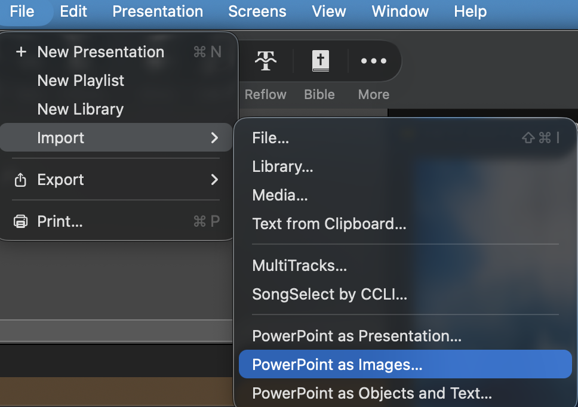
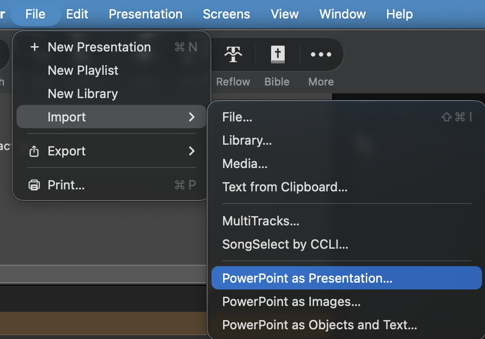

# What Comes Next: Remaining Artifacts & Content

[← Back to Home](../index.md) | [User Guide](../user-guide)

---

After exporting your song lyrics to PowerPoint, you'll likely want to add other content to complete your Sunday service presentation. This guide covers importing the remaining artifacts that ProPresenter Lyrics Export doesn't handle directly: sermon content, kids' content, and birthday blessings.

## Table of Contents

1. [Overview: What Gets Added Later](#overview-what-gets-added-later)
2. [Sermon Content (Main Service)](#sermon-content-main-service)
3. [Kids' Sermon Content](#kids-sermon-content)
4. [Birthday Bucket / Birthday Blessings](#birthday-bucket--birthday-blessings)
5. [Best Practices](#best-practices)

---

## Overview: What Gets Added Later

ProPresenter Lyrics Export focuses on one thing: **extracting and exporting song lyrics from your worship library**. But a complete Sunday service presentation in ProPresenter typically includes:

| Content Type | Method | Format | Purpose |
|---|---|---|---|
| **Song Lyrics** | ProPresenter Lyrics Export | PPTX + Audio | Congregation singing |
| **Sermon** | Manual import | Images + Video | Main message |
| **Kids' Content** | Manual import | Images + Video | Children's service |
| **Announcements** | Service Generator (optional) | Text + Images | Important notices |
| **Birthday Blessings** | Manual import | PowerPoint | Celebrate congregants |

This guide focuses on the manual imports (Sermon, Kids' Content, Birthday Blessings) that come **after** you've exported your lyrics.

---

## Sermon Content (Main Service)

Your sermon is typically delivered with visual support—slides, graphics, video, or photo backgrounds. Here's how to bring that into ProPresenter.

### Method 1: Import Images (Recommended for Most Sermons)

Use image-based imports when your sermon content is a sequence of static images, graphics, or screenshots.

#### Step-by-Step: Import Sermon Images

1. **Organize your images**
   - Place all sermon images in a single folder (e.g., `Sermon_2026_02_09/`)
   - Name them sequentially if order matters:
     - `01_title.png`
     - `02_main_point.png`
     - `03_supporting_graphic.png`
     - etc.
   - Supported formats: PNG, JPG, JPEG, GIF, TIFF

2. **In ProPresenter:**
   - Right-click on your target playlist (or service playlist)
   - Select **Import** → **Images**
   - Browse to your sermon images folder
   - ProPresenter will create slides for each image in order

   

3. **Position in playlist**
   - Drag the imported image group to the correct position in your service flow
   - Typically between songs or as a dedicated sermon section

#### Best Practices for Sermon Images

- **Resolution**: Use at least 1920x1080 for good quality on projection
- **Aspect ratio**: Match your presentation display (usually 16:9)
- **File size**: Keep individual images under 10 MB for smooth playback
- **Naming**: Use descriptive names (not generic like "image1.png")
- **Organization**: One folder per sermon for easy reuse and updates

### When to Use Image Import

✓ PowerPoint slides exported as images
✓ Graphic design work (Canva, Illustrator, etc.)
✓ Photo montages or backgrounds
✓ Multi-slide teachings with visual progression
✓ Motion graphics or animated GIFs

---

## Kids' Sermon Content

Kids' content follows the same import process as main sermon content, but with different file organization and considerations.

### Method 1: Import Images (Recommended)

Kids' sermons often rely on colorful graphics and engaging visuals. Import them the same way as main sermon images:

1. **Organize kids' images**
   - Create a dedicated folder for kids' content (e.g., `Kids_2026_02_09/`)
   - Name images to reflect the story flow:
     - `01_welcome_slide.png`
     - `02_character_intro.png`
     - `03_story_action.png`
     - etc.

2. **In ProPresenter:**
   - Right-click on your **Kids Library** or kids playlist
   - Select **Import** → **Images**
   - Select the kids' content folder
   - ProPresenter creates slides for each image

3. **Position in service**
   - Place the imported kids' section where your children's service occurs
   - Typically right after opening songs and before kids dismiss

#### Special Considerations for Kids' Content

- **Bright colors**: Kids' content should be visually engaging
- **Large text**: If text is included, use fonts ≥32pt for kids to read
- **Shorter sequences**: Kids' attention spans are shorter—fewer slides work better
- **Consistency**: Use the same design style week-to-week for brand recognition

---

## Birthday Bucket / Birthday Blessings

Birthday Blessings is a special feature in ProPresenter that displays birthday announcements with customizable text and animations. Rather than importing static images, you'll work with **editable PowerPoint presentations** that you can customize.

### Method: Import PowerPoint for Birthday Bucket

Birthday Blessings work best when imported as a PowerPoint presentation, which allows you to:
- Edit names and dates directly
- Customize the greeting message
- Adjust fonts, colors, and animations
- Reuse the template each week

#### Step-by-Step: Import Birthday Blessing PowerPoint

1. **Prepare your PowerPoint template**
   - Create a PowerPoint file with placeholder slides (one per birthday)
   - Each slide should have:
     - Name (editable text field)
     - Birthday date or age
     - Custom message or greeting
     - Optional: Birthday graphics or animations

2. **In ProPresenter:**
   - Right-click on your target playlist
   - Select **Import** → **PowerPoint File**
   - Browse and select your birthday blessing PowerPoint
   - ProPresenter converts each slide to an editable presentation

   

3. **Edit the presentation in ProPresenter**
   - Double-click each birthday slide to edit
   - Update the name to the birthday person
   - Adjust text formatting if needed
   - Save changes

4. **Position in service**
   - Place birthday slides near the end of your service
   - Often used during announcements or closing time

#### PowerPoint Template Tips

**Template Structure:**
```
Slide 1: Birthday Blessing Template (title/instructions)
Slide 2: [Name] Birthday Slide
Slide 3: [Name] Birthday Slide
...
```

**Editable Elements:**
- Text boxes with names (change names week-to-week)
- Dates or age fields
- Custom messages
- Birthday graphics or backgrounds

**Formatting Notes:**
- ⚠️ After importing to ProPresenter, double-check your formatting
- Some fonts may change slightly
- Animations may need adjustment
- Test the display on your actual projection screen

#### Best Practices for Birthday Blessings

✓ Use consistent formatting across all birthday slides
✓ Keep text large and readable from a distance (≥28pt)
✓ Include a default slide for "other birthdays" in the month
✓ Add subtle animations for visual interest (optional)
✓ Update the template 1-2 weeks before using (not during service)

---

## Best Practices

### Workflow Integration

**Your complete Sunday service workflow should look like:**

1. **Export lyrics** → ProPresenter Lyrics Export (creates PPTX with song lyrics)
2. **Add sermon content** → Import images or PowerPoint (you handle this)
3. **Add kids' content** → Import images for children's service (you handle this)
4. **Add birthday blessings** → Import PowerPoint template (you handle this)
5. **Arrange playlist** → Drag items into service order in ProPresenter
6. **Test and preview** → Run through the service once before Sunday

### File Organization

Keep your content organized for faster workflow:

```
2026_02_09_Sunday_Service/
├── Lyrics_Export.pptx          (from ProPresenter Lyrics Export)
├── Sermon_Content/
│   ├── 01_title.png
│   ├── 02_main_point.png
│   └── 03_prayer_graphic.png
├── Kids_Content/
│   ├── 01_welcome.png
│   ├── 02_story.png
│   └── 03_game.png
└── Birthday_Blessing_2026_02.pptx
```

### Quality Checklist Before Service

- [ ] All images imported and in correct order
- [ ] Playlist arranged in correct service flow
- [ ] Sermon images display properly on projection
- [ ] Kids' content is age-appropriate and visible
- [ ] Birthday slides have correct names and dates
- [ ] All fonts are readable at viewing distance
- [ ] Audio/video (if used) plays without issues
- [ ] Tested presentation on actual display (not just laptop)

---

## Related Guides

- **[PPTX Export](./pptx-export)** - Customize your song lyric exports
- **[Service Generator](./service-generator)** - Automate playlist building from PDFs (alternative workflow)
- **[ProPresenter Setup](../getting-started)** - Initial ProPresenter configuration

## Need Help?

- 📖 Check the [FAQ](../faq) for common import issues
- 🎨 See [PPTX Export Guide](./pptx-export) for customizing lyrics
- 💬 Open an [issue on GitHub](https://github.com/adamswbrown/propresenterlyricexport/issues)
