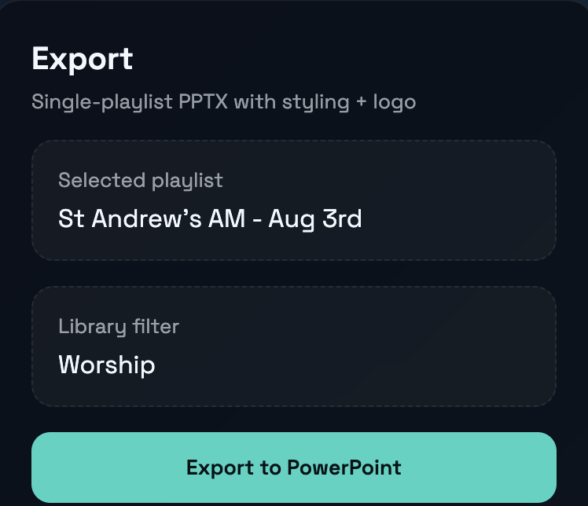
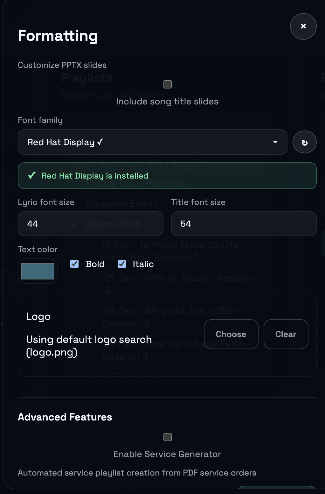

# PPTX Export Guide

[← Back to Home](../index.md) | [User Guide](../user-guide)

---

Export your ProPresenter playlist lyrics to beautifully formatted PowerPoint files in seconds.

---

## Quick Export (3 Steps)

Exporting lyrics is simple:

### Desktop App

1. **Connect** to ProPresenter
2. **Select** your playlist
3. **Click "Export to PPTX"**

That's it! Your PowerPoint file is ready.



### CLI

```bash
# Interactive mode - guides you through selection
propresenter-lyrics pptx

# Direct export - specify playlist UUID and output name
propresenter-lyrics pptx abc123 sunday-service
```

---

## What You Get

Every export creates a professional PowerPoint with:

- **Title slides** for each song (song name, artist info)
- **Lyric slides** with clean, readable formatting
- **Consistent styling** throughout the presentation
- **Ready to present** - just open and go

Your exported file works in:
- Microsoft PowerPoint
- Google Slides
- LibreOffice Impress
- Keynote (with conversion)

---

## Customizing Your Exports

Want to match your church's branding? Customize fonts, colors, and more.

### Desktop App Settings

Click ⚙ **Settings** to access all customization options:



### Quick Customization Options

| Setting | Default | What it does |
|---------|---------|--------------|
| **Font** | System default | Choose from 25+ presentation fonts |
| **Text color** | White | Any color via color picker |
| **Font size** | 44pt | Lyric text size (40-48pt recommended) |
| **Title size** | 54pt | Song title size |
| **Bold** | On | Makes text bolder |
| **Italic** | On | Adds italic styling |
| **Logo** | None | Add your church logo |

---

## Fonts

### Choosing a Font

The desktop app shows 25+ curated presentation-ready fonts:

- **Green ✓** = Installed on your computer
- **Gray ○** = Available to download (click to open Google Fonts)

**Recommended fonts:**

| Type | Best For | Examples |
|------|----------|----------|
| **Sans-serif** | Modern, clean | Arial, Open Sans, Roboto, Montserrat |
| **Serif** | Traditional, elegant | Georgia, Times New Roman, Merriweather |
| **Display** | Bold impact | Impact, Oswald, Bebas Neue |

### Installing Missing Fonts

1. Click the gray ○ next to the font name
2. Google Fonts opens in your browser
3. Download and install the font
4. Click **Refresh** in Settings

---

## Colors

### Text Color

- **Default:** White (#FFFFFF)
- **Tip:** Light colors on dark backgrounds work best
- Click the color picker in Settings to choose any color

### Background

- **Default:** Black (#000000)
- **Tip:** Dark backgrounds reduce eye strain and improve readability

---

## Logo

Add your church or organization logo to title slides:

1. Click **Settings** ⚙
2. Browse to your logo image (PNG recommended)
3. Logo appears on title slides automatically

**Best practices:**
- Use transparent PNG files
- Resolution: 300-1000px
- Square or landscape orientation

---

## Style Presets

Quick combinations for common looks:

### Modern Minimal
```
Font: Open Sans | Size: 44pt | Bold: Off | Italic: Off
```
Best for: Contemporary worship, clean aesthetic

### Elegant Classic
```
Font: Georgia | Size: 48pt | Bold: On | Italic: On
```
Best for: Traditional services, formal events

### Bold Impact
```
Font: Impact | Size: 52pt | Bold: On | Italic: Off
```
Best for: Youth services, high-energy worship

---

## CLI Customization

Set options via environment variables:

```bash
# Font and size
export PP_FONT_FACE="Arial"
export PP_FONT_SIZE=44
export PP_TITLE_SIZE=54

# Colors (hex without #)
export PP_TEXT_COLOR=FFFFFF

# Formatting
export PP_BOLD=true
export PP_ITALIC=true

# Then export
propresenter-lyrics pptx abc123 output
```

---

## Best Practices

### For Readability
- Use **high contrast** (light text on dark background)
- Keep fonts **40pt minimum** for audience visibility
- Avoid decorative or script fonts

### For Consistency
- Use the same font throughout your service
- Keep logo subtle - don't overpower the lyrics
- Test on your actual projector before Sunday

---

## Technical Details

### What Gets Exported

Each slide contains:

1. **Title slides** (one per song)
   - Song title in large text
   - Album/Artist information
   - Optional logo image

2. **Lyric slides** (one per verse/section)
   - Formatted lyrics text
   - Consistent styling

3. **Metadata** (embedded)
   - Song information
   - Export date/time
   - Playlist name

### Default Slide Layout

```
[Dark background]

                    SONG TITLE
                    Artist Name

    Verse lyrics appear here,
    centered and easy to read,
    with comfortable line spacing.
```

### File Specifications

- **Format:** .pptx (Office Open XML)
- **Typical size:** 1-10MB
- **Slide count:** Varies by playlist (typically 50-200)

---

## Troubleshooting

### Font Looks Different

**Problem:** Font appears different than expected

**Fix:** The font must be installed on the computer opening the file. Use system fonts (Arial, Helvetica) for maximum compatibility.

### Colors Look Wrong on Projector

**Problem:** Colors appear different on projector vs. screen

**Fix:** Projectors display differently. Test on your actual projector and use high-contrast combinations (white on black).

### Logo Missing

**Problem:** Logo doesn't appear in exported file

**Fix:** Verify the file path is correct and the image is PNG or JPEG format.

### File Too Large

**Problem:** Exported file is 50MB+ (should be <20MB)

**Fix:** Compress your logo image or use system fonts instead of custom fonts.

---

## Advanced: Batch Export

Export multiple playlists with consistent styling:

```bash
#!/bin/bash
export PP_FONT_FACE="Montserrat"
export PP_TEXT_COLOR="FFFFFF"
export PP_FONT_SIZE=44

for uuid in playlist1 playlist2 playlist3; do
  propresenter-lyrics pptx "$uuid" "export-$uuid"
done
```

---

## See Also

- [User Guide](../user-guide.md) - Full app documentation
- [CLI Guide](./cli-guide.md) - Command reference
- [Getting Started](../getting-started.md) - Installation
