# Service Generator Guide

[← Back to Home](../index.md) | [User Guide](../user-guide)

---

Automate your Sunday service playlist creation from PDF service orders in minutes.

> **Note:** Service Generator is an **optional advanced feature**. The core functionality of ProPresenter Lyrics Export is extracting lyrics from existing playlists. Service Generator extends this by helping you build playlists from PDF service orders.

## How to Enable Service Generator

**Desktop App:**
1. Open the desktop app
2. Look for the **"Service Generator"** tab at the top of the window
3. Click to open the Service Generator interface

**CLI:**
Service Generator is only available in the desktop app. CLI users should use the standard export commands.

---

## What is Service Generator?

Service Generator takes a PDF service order (from Planning Center, Proclaim, ChurchPlanner, etc.) and **automatically populates your ProPresenter playlist** with:
- ✓ Song items matched to your library
- ✓ Bible passages linked to presentations
- ✓ Service structure and announcements
- ✓ Kids content properly categorized

**Time saved:** What normally takes 15-20 minutes of manual playlist building now takes 2-3 minutes.

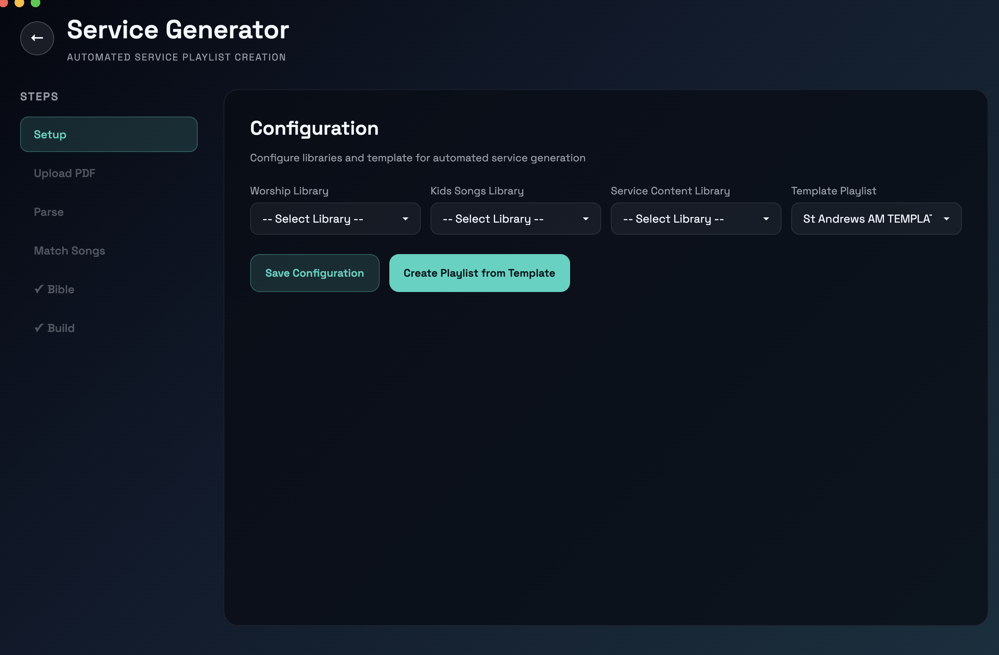

## How It Works (6-Step Workflow)

### Step 1: Setup (One-Time Configuration)

Configure which libraries and playlists to use:

- **Worship Library** - Your main song/worship library (e.g., "Worship")
- **Kids Library** - Separate library for children's content (e.g., "Kids")
- **Service Content Library** - Library containing Bible verses and service elements
- **Target Playlist** - The playlist to populate with this week's service

**How to find your libraries:**
1. In the desktop app, look at available libraries (loaded during connection)
2. You'll typically have: "Worship," "Service Content," "Kids," "Announcements," etc.
3. Select the ones that match your workflow

Once configured, these settings are saved and remembered for future uses.

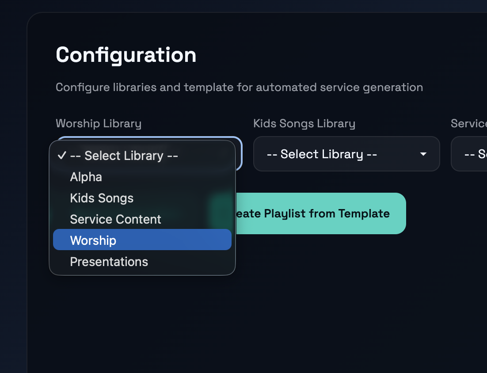


### Step 2: Upload PDF

1. Click **"Select PDF"** or drag-and-drop a PDF file
2. Choose your service order (from Planning Center, Proclaim, etc.)
3. The app loads and prepares the document

**Supported PDF formats:**
- Planning Center service orders
- Proclaim service orders
- ChurchPlanner exports
- Any PDF with song titles and scripture references

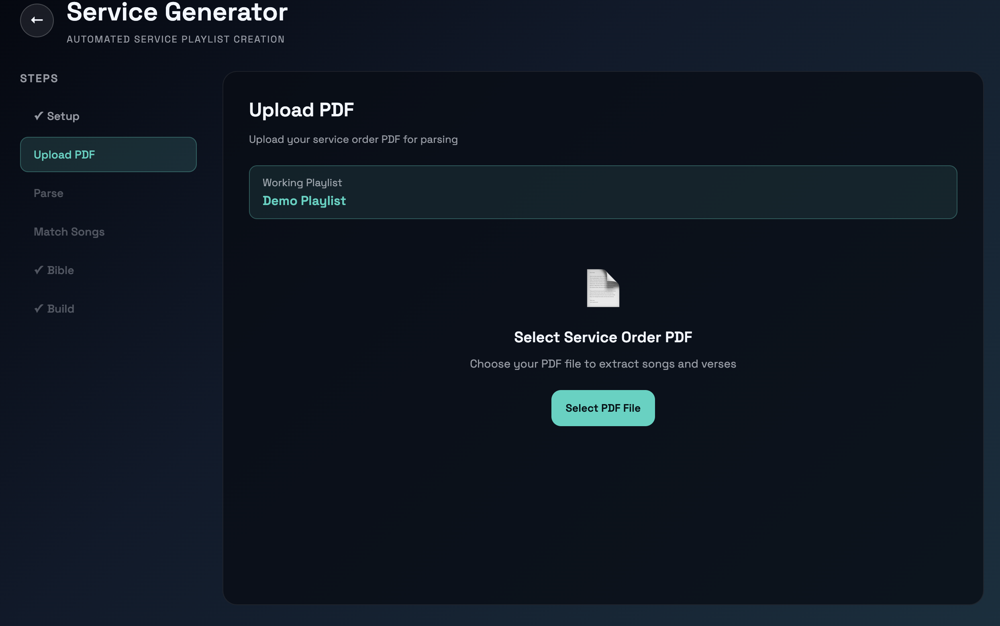

### Step 3: Parse

The app **automatically extracts** from your PDF:
- **Song titles** - Detected in common list formats
- **Bible verses** - Identified by book/chapter:verse patterns (e.g., "Romans 12:1-2")
- **Kids items** - Marked by keywords ("kids video," "children's story," etc.)
- **Service sections** - Announcements, prayers, special items
- **Worship slots** - Automatically categorized (Praise 1, Praise 2, Praise 3)

**What you see:** A preview list of everything extracted from the PDF, organized by section.

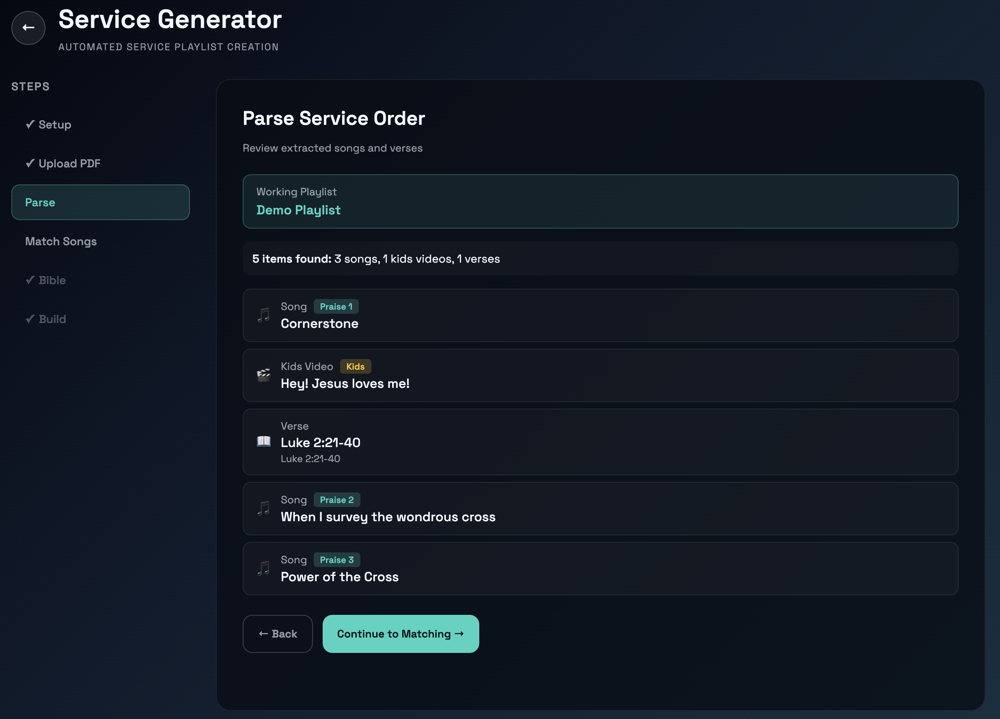

### Step 4: Match Songs

Each extracted song is matched against your Worship Library:

**For each song:**
- The app shows the best matches with **confidence scores**
- **Green (>90%)** - High confidence, auto-selected
- **Yellow (70-90%)** - Medium confidence, review recommended
- **Red (<70%)** - Low confidence, probably wrong

**What to do:**
1. **Accept green matches** - Leave as-is
2. **Review yellow/red matches** - Click to select the correct song
3. **Manual selection** - If no match found, search by typing
4. **Skip items** - Some items might not be songs (announcements, etc.)

**Step complete when:** All songs are matched or explicitly skipped.

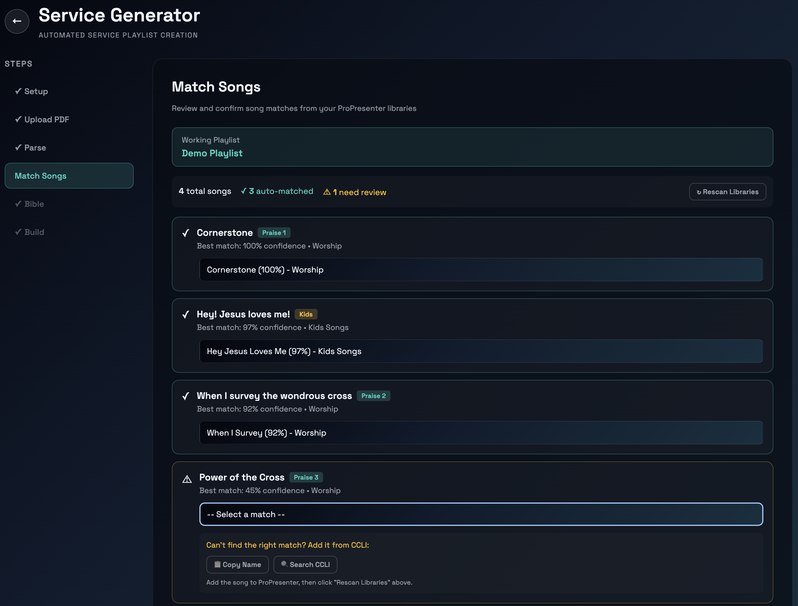

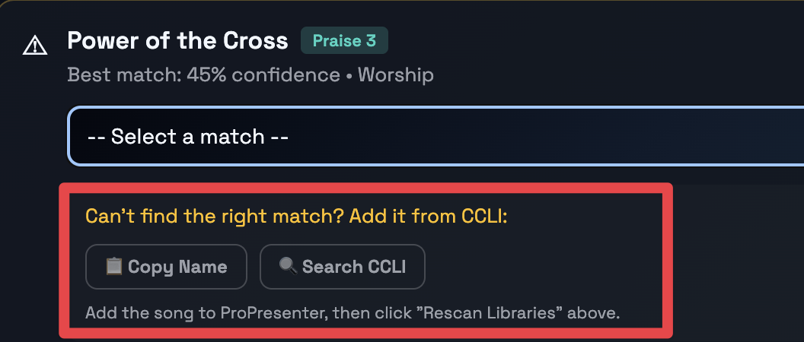

#### Can't Find a Song? Use CCLI Song Select

If Service Generator can't find a song in your Worship Library, you can search for it using CCLI Song Select:

**Step-by-step:**

1. **Copy the song name**
   - In the Service Generator interface, click the **"Copy Name"** field next to the unmatched song
   - This copies the song title to your clipboard

2. **Search CCLI Song Select**
   - Click **"Search CCLI"** button in Service Generator
   - This opens your default browser to **CCLI Song Select** (ccli.com/songsselect)
   - Log in with your CCLI username and password
   - Paste the song name in the search field
   - Find the correct song in the results

3. **Get the CCLI Song Number**
   - Once you've found the song, note its **CCLI Song Number** (a unique 7-8 digit code)
   - This is the ID number you need to copy to search in ProPresenter
   - Copy this number


4. **Search in ProPresenter**
   - Open ProPresenter
   - Click the **Search icon** (magnifying glass)
   - Enter the CCLI Song Number in the search field
   - ProPresenter will search its database for songs matching that number


5. **Import into Your Worship Library**
   - When ProPresenter finds the song, select it from the results
   - **Import it into your Worship Library** (the same library you configured in Service Generator Step 1 - typically "Worship")
   - Save the import

6. **Re-run Service Generator**
   - Return to Service Generator
   - Click **"Re-scan Library"** or restart from Step 4 (Match Songs)
   - Service Generator will now find the newly imported song and match it automatically

**Tips:**
- Make sure to import into the correct library (your "Worship" library, not a different one)
- If the song still doesn't match, try a slightly different spelling or search again
- Some songs may have multiple CCLI numbers (different arrangements); try different results if the first doesn't work

### Step 5: Bible (Verses & Presentations)

Match scripture references to your Service Content library:

**For each verse reference (e.g., "John 3:16"):**
- The app searches your Service Content library
- Shows matching presentations with confidence scores
- **Green** - Strong match, auto-selected
- **Yellow** - Possible matches, pick the right one
- **Red** - No match found

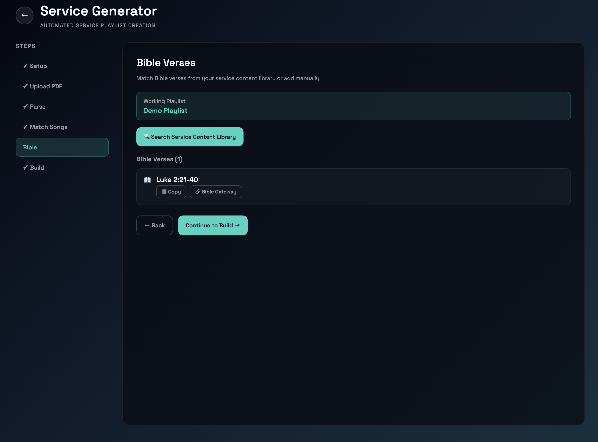

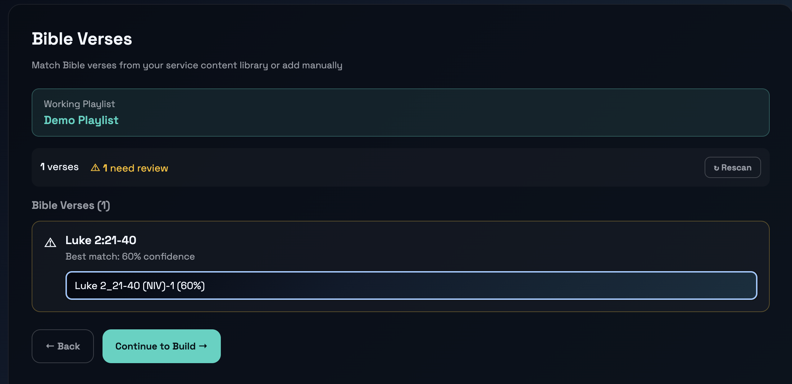

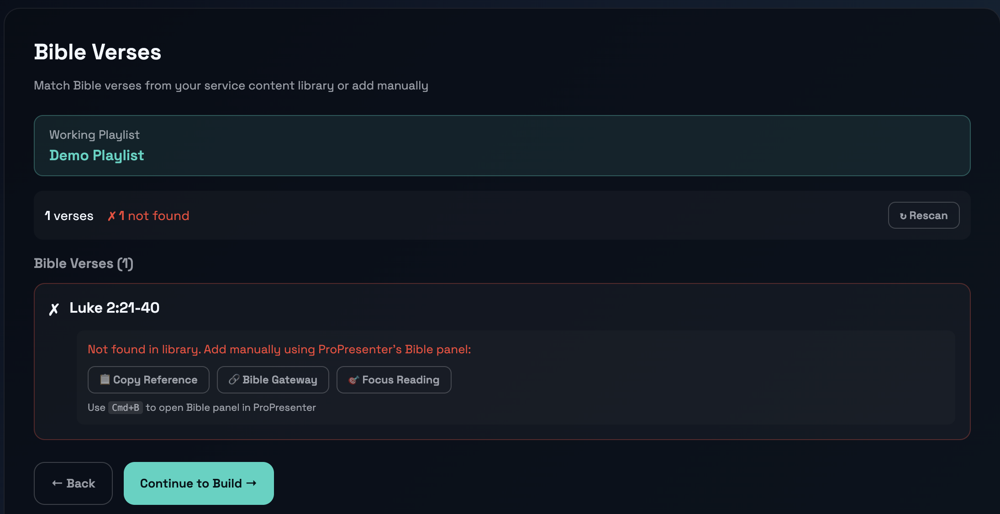

**When no match is found:**
- **Copy to clipboard** - Copy the reference
- **Open Bible Gateway** - Opens the verse in a web browser
- **Focus ProPresenter** - Opens the Bible reading panel in ProPresenter (Cmd+B)
- Then manually add the verse to your Service Content library and re-run

**Step complete when:** All verses are matched or marked as manual.

### Step 6: Build

The app **automatically creates your playlist** with:
1. Opening section (pre-roll, announcements)
2. Songs in correct order with matched library items
3. Bible passages inserted at the right moments
4. Service sections and transitions
5. Kids content separated and properly organized

**Result:**
- Your target playlist is populated and ready
- All items are linked to your actual library presentations
- Structure matches your service order

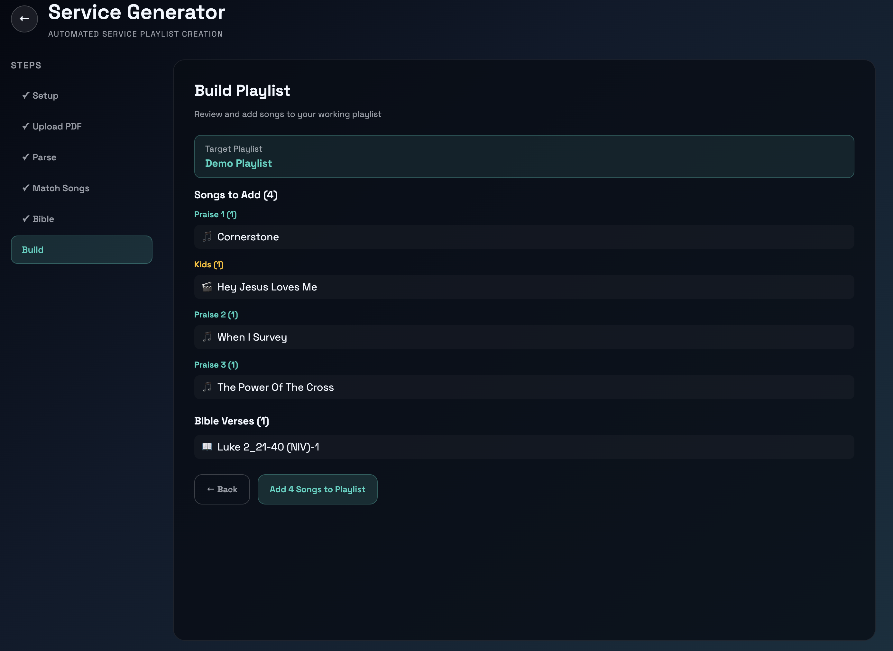

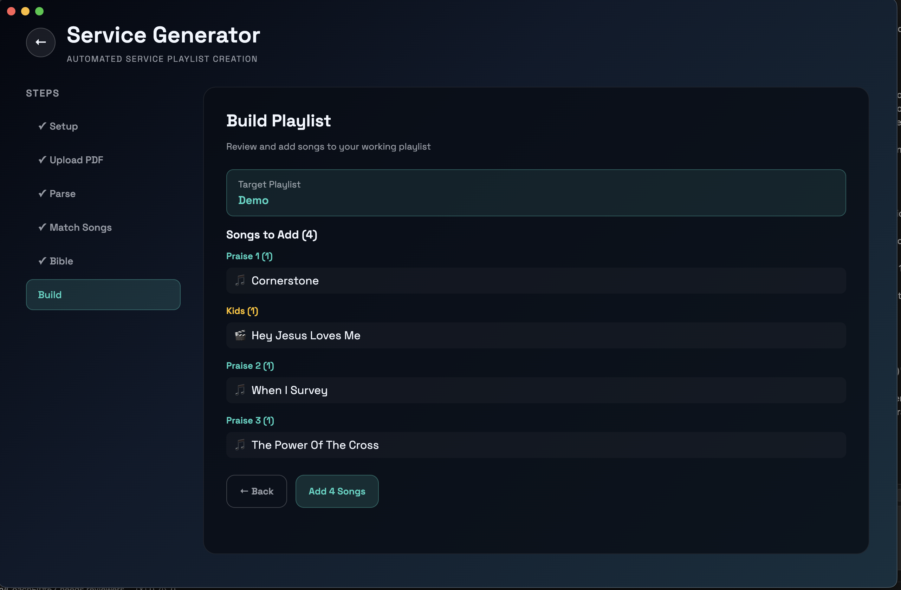

**Final touches:**
- Drop in your Birthday Bucket, Sermon, and Kids Talk PowerPoints manually
- Use ProPresenter's "Import PPT as Presentation" for editable slides

---

## Workflow Details

### Song Matching

The fuzzy-match engine searches for songs in three ways:

1. **Exact title match** - Looks for exact song names
2. **Partial match** - Finds songs with similar titles
3. **Phonetic match** - Handles spelling variations

**Examples:**
- "Jesus Loves Me" → Finds your "Jesus Loves Me (2023 Version)"
- "Amazing Grace" → Matches "Amazing Grace (Hymn Arrangement)"
- "Worthy Is The Lamb" → Finds "Worthy Is The Lamb (Newsboys)"

**High confidence (>90%):**
- Very similar title
- Likely the correct song
- Auto-selected

**Manual review (70-90%):**
- Possible match
- Could be a different version
- You pick which one

**No match (<70%):**
- Probably not in your library yet
- See [Can't Find a Song? Use CCLI Song Select](#cant-find-a-song-use-ccli-song-select) in Step 4 above

### Bible Matching

Scripture references are matched against presentations in your Service Content library:

**Typical references:**
- `John 3:16` - Single verse
- `Romans 12:1-2` - Verse range
- `1 Corinthians 13` - Whole chapter
- `Psalm 23:1-6` - Multiple verses

**Matching logic:**
1. Exact book/chapter/verse match
2. Same book and chapter (any verse)
3. Same book (any chapter)

**Common issues:**
- **Different translation?** - "KJV" vs "NIV" in title won't match; these are different presentations
- **Not found?** - Create the presentation in Service Content library first, then re-run
- **Multiple versions?** - You pick which translation/version to use

#### Adding Bible Verses to ProPresenter

If a Bible verse isn't found in your Service Content library, you'll need to add it manually to ProPresenter. Watch this short video to learn how:

<iframe width="560" height="315" src="https://www.youtube.com/embed/-QcnpuenVno" title="Adding Bible Verses to ProPresenter" frameborder="0" allow="accelerometer; autoplay; clipboard-write; encrypted-media; gyroscope; picture-in-picture; web-share" allowfullscreen></iframe>

Once you've added the verse to your Service Content library, return to Service Generator and click **"Re-scan Library"** to find the newly added verse.

### Worship Slot Detection

The app automatically identifies worship segments:

- **Praise 1** - First worship song block
- **Praise 2** - Second worship song block
- **Praise 3** - Third worship song block
- **Kids** - Children's content

**How it works:**
- Looks for keywords ("Praise," "Worship," "Kids," "Children," etc.)
- Section breaks in the PDF indicate new slots
- Comments in Planning Center are parsed

**Manual override:**
- Right-click any song in Step 4 to reassign its worship slot
- Useful if automatic detection isn't quite right

### Special Services Detection

Service Generator automatically detects **special services** and adjusts handling accordingly.

**Special services detected:**
- **Remembrance Sunday** - (e.g., Nov 9) - Includes memorial hymns and reflective videos
- **Christmas Services** - (Dec 21-25) - Christmas carols and nativity-related items
- **Christmas Eve / Nativity** - Special children's/family services
- **Easter Services** - (April 18-27) - Passion narratives and Easter-themed content
- **Carol Service** - Music-focused services
- **Communion Services** - Including new member welcoming services
- **Good Friday** - Scriptural meditation and reflection

**What happens when a special service is detected:**

1. **Warning banner appears** - "⚠️ Special Service Detected: This is a [service type] service. Service Generator may handle videos and structure differently."

2. **Videos handled correctly** - In special services, videos are not automatically assumed to be kids content
   - Example: "Remembrance Hymn (Video)" in a Remembrance service is matched as a worship song, not kids content
   - Only videos explicitly marked with "kids" keyword (e.g., "John 3:16 Song (Kids Video)") go to the kids library

3. **Structure awareness** - Special services may have different structure than regular Sunday worship
   - Notification shows: "Found X items in PDF (remembrance service)"
   - Helps you understand why the layout might be different from usual

**Practical example:**

| Regular Sunday | Remembrance Sunday |
|---|---|
| PRAISE: Jesus Loves Me | PRAISE: Remembrance Hymn (Video) |
| → Matched to Kids Library | → Matched to Worship Library (not kids!) |
| Result: Kids content slide | Result: Hymn video presentation |

If you see unexpected video behavior in special services, remember that the app intelligently distinguishes between:
- **Kids videos** - Explicitly marked "Kids Video" or "Children's Video"
- **Ceremonial/hymn videos** - Used in special services, matched as regular content

### Video Placement Recognition

Service Generator recognizes that videos can appear throughout a service, not just in the kids section. Videos are automatically placed in the appropriate worship slot based on their position in the service order.

**Common video placements:**

| Placement | Example | Handling |
|---|---|---|
| **Early (10-25%)** | Opening worship song video | Matched to appropriate library based on content |
| **Middle (40-60%)** | Mid-service reflection video | Placed in Praise 2 slot or after sermon |
| **End (80%+)** | Closing/finishing video | Placed at end of worship (Praise 3 or closing) |
| **Special services** | Remembrance hymn video, Christmas carol video | Not assumed to be kids content |

**Real data from 62 services:**
- **64 videos** across services
- **2 videos** at the very end as finisher (83% through service)
- **8 videos** in the middle as transition piece (40-60%)
- **54 videos** in early/praise slots (10-40%)

**Examples:**

1. **Christmas Service** - "Glory in the Manger" at 83% (finishing video)
   - Placed in Praise 3 slot to wrap up service

2. **Regular Sunday** - "If God is for me" at 50% (transition video)
   - Placed after prayer/reflection, before final song

3. **Remembrance Sunday** - "Remembrance Hymn" at 71% (closing reflection)
   - Placed in Praise 3 slot as closing meditation

**How it works:**
- Service Generator detects video position in the PDF
- Automatically assigns to the appropriate praise slot
- Videos early in service → Praise 1
- Videos mid-service → Praise 2 or after sermon section
- Videos near end → Praise 3 or closing section

**Library routing:**
- **Non-kids videos** (Remembrance hymn videos, closing videos, transition videos) → Searched in **Service Content library**
  - These are service elements, not songs
  - Better organized with other service presentations
- **Kids videos** (explicitly marked with "kids") → Searched in **Kids library**
- **Regular songs** → Searched in **Worship library**

**Examples:**

1. **Christmas Service** - "Glory in the Manger" at 83% (finishing video)
   - Searched in Service Content library
   - Placed in Praise 3 slot to wrap up service

2. **Remembrance Sunday** - "Remembrance Hymn" at 71% (closing reflection)
   - Searched in Service Content library (not kids!)
   - Placed in Praise 3 slot as closing meditation

3. **Regular Sunday** - "If God is for me" at 50% (transition video)
   - Searched in Service Content library
   - Placed in Praise 2 slot (bridges sermon and closing worship)

**Tips:**
- Make sure to populate your **Service Content library** with video presentations
- Videos as "finishing pieces" work well at the end of services (70%+ position)
- Transition videos in the middle (40-60%) bridge sermon and closing worship
- The app handles placement and library routing intelligently

---

### Before Running Service Generator

1. **Ensure your libraries are set up:**
   - Create a "Worship" library with your songs
   - Create a "Service Content" library with verses and announcements
   - Create a "Kids" library if you have kids content
   - Create your target playlist (can be empty)

2. **Add missing presentations first:**
   - If you know a song isn't in your library, add it before running
   - Same for Bible verses - create them in Service Content first
   - This makes matches more successful

3. **Use consistent naming:**
   - Song titles in Planning Center should match your library
   - Bible passages should be in format "Book Chapter:Verse"

### During the Workflow

1. **Don't rush yellow/red matches**
   - Review them carefully
   - Better to skip and add manually than use wrong song

2. **Use the search feature**
   - Click the match row to open a search dialog
   - Type to find the right song/verse
   - Helpful for typos or variations

3. **Mark as manual carefully**
   - "Manual" means you'll add it to ProPresenter later
   - Make a note of which items are manual
   - Don't forget to add them!

### After Building

1. **Review the playlist**
   - Check the order makes sense
   - Verify songs are the right versions
   - Look for any oddities

2. **Add remaining items**
   - Birthday Bucket presentation
   - Sermon presentation
   - Kids Talk presentation
   - Any other special segments

3. **Customize if needed**
   - Adjust song order (drag in ProPresenter)
   - Add or remove items
   - Add transition slides

4. **Test before Sunday**
   - Open the playlist in ProPresenter
   - Preview each song to ensure correct content
   - Check any custom formatting

---

## Troubleshooting

### No songs found in library

**Problem:** "No matches" shown for all songs

**Solutions:**
1. Verify the Worship Library is correct (check its name)
2. Ensure songs are actually in the library
3. Check song titles match what's in Planning Center
4. Try manual search for one song to debug

### Bible verses not matching

**Problem:** Verse references show "No match"

**Solutions:**
1. Verify Service Content library has the verses
2. Check verse format in the PDF (should be "John 3:16" style)
3. Try different Bible translation if available
4. Use "Open Bible Gateway" fallback to manually create presentation

### Wrong songs getting selected

**Problem:** High confidence match is wrong

**Solutions:**
1. Songs probably have similar titles in your library
2. Check if you have duplicates with different versions
3. Manually override each one in Step 4
4. Consider renaming songs to be more distinct

### PDF won't upload

**Problem:** "Invalid PDF" or upload fails

**Solutions:**
1. Ensure it's a valid PDF file (not corrupted)
2. Try opening it in another PDF reader
3. Try a different service order (different format)
4. Check file size (should be <50MB)

---

## Understanding Service Libraries

Service Generator relies on three types of libraries in ProPresenter. Understanding what each does will help you set it up correctly.

### Worship Library

**What it is:** Your main library containing all worship songs and hymns

**What it contains:** 
- Song presentations (e.g., "Amazing Grace", "Jesus Loves Me", "Come Thou Fount")
- Slide decks with lyrics for each song
- Typically named "Worship," "Songs," "Music Library," or similar

**What Service Generator does:**
- Reads the PDF to find song titles (e.g., "Come Thou Fount")
- Searches this library for matching presentations
- When matched, adds them to your playlist in the correct worship slot (Praise 1, Praise 2, Praise 3)

**Example:** PDF says "Come Thou Fount" → App finds "Come Thou Fount" presentation → Adds to Praise 1 section

### Kids Library

**What it is:** A separate library for children's songs and activities

**What it contains:**
- Kids-oriented presentations
- Children's songs, games, activities
- Typically named "Kids," "Children," "Kids Songs," etc.

**What Service Generator does:**
- Detects kids items in the PDF (looks for "kids video," "kids song," "children's story," etc.)
- Searches this library instead of the Worship library
- Adds them to the Kids Talk section with their own categorization

**Example:** PDF says "Kids Video: Sing Wherever I Go" → App finds in Kids library → Adds to Kids Talk section

### Service Content Library

**What it is:** A library containing Bible verses, videos, announcements, and service elements

**What it contains:**
- Bible verse presentations (named like "John 3:16 (NIV)", "Psalms 56_1-13 (NIV)", "Luke 2_21-40 (NIV)-1")
- **Video presentations** - Remembrance videos, closing/finishing videos, transition videos, etc.
- Announcements and service content
- Prayer slides, special presentations
- Typically named "Service Content," "Scripture," "Announcements," etc.

**What Service Generator does:**
- **For scripture:** Extracts scripture references from the PDF (e.g., "Luke 2:21-40")
  - Matches them against presentations in this library
  - Uses smart matching to handle different formatting
  - When matched, adds them to your Reading section
- **For videos:** Extracts non-kids videos from the PDF
  - Videos without explicit "kids" keyword are matched here
  - Examples: Remembrance Hymn videos, closing/finishing videos, transition videos
  - When matched, adds them to the appropriate praise slot

**Important:** 
- **Bible verses** MUST be named in a consistent format:
  - `Book Chapter_Verse (VERSION)` format
  - Examples: `John 3_16 (NIV)`, `Romans 12_1-2 (ESV)`, `Psalms 56_1-13 (NIV)`
  - Or with colons: `John 3:16 (NIV)`
  - Version suffixes are handled automatically

- **Videos** should be named descriptively:
  - `Remembrance Hymn`, `Glory in the Manger`, `Jesus Loves Me (Video)`, etc.
  - These will be matched by fuzzy search to your library

**Examples:**
- PDF says "Luke 2:21-40" → App matches against "Luke 2_21-40 (NIV)-1" → Adds to Reading section
- PDF says "Remembrance Hymn (Video)" → App searches Service Content → Adds to Praise 3 section

### Library Setup Checklist

Before using Service Generator, ensure you have:

- ✅ **Worship Library** with your songs/hymns
- ✅ **Kids Library** with children's content (if you have kids items)
- ✅ **Service Content Library** with:
  - Bible verse presentations named consistently (Book Chapter_Verse format)
  - Service announcements and special content
- ✅ **Target Playlist** (empty or with your template structure)

---

## Service Library Structure

Before using Service Generator, you'll want to organize your ProPresenter libraries to match how the app routes different content types. Service Generator intelligently places songs, scripture references, and videos into the appropriate library based on their type.

### Recommended Library Organization

Service Generator works best when you have three libraries set up:

#### 1. **Worship Library** (Primary - for songs)
- **Purpose**: Contains regular worship songs
- **What goes here**: All hymns, contemporary worship songs, and praise songs
- **Examples**: "Amazing Grace", "Jesus Loves Me", "Come Thou Fount", "Glory Be to God"
- **Naming**: Use consistent song titles matching your service orders
- **Tips**: Keep this organized alphabetically or by category for easy browsing

#### 2. **Service Content Library** (Secondary - for videos and ceremony elements)
- **Purpose**: Contains videos, transitions, ceremony elements, and service components
- **What goes here**: 
  - Hymn/scripture videos (not kids-specific)
  - Transitions and visual elements
  - Ceremony videos (communion, baptism, etc.)
  - Reflective or closing videos
  - Any video marked with "(Video)" in the service order
- **Examples**: "Remembrance Hymn (Video)", "Communion Reflection", "Easter Sunrise (Video)", "Benediction"
- **Naming**: Use descriptive names that match your service order exactly
- **Tips**: Prefix with content type for easy identification (e.g., "Video:" or "Ceremony:")

#### 3. **Kids Library** (Tertiary - for children's content)
- **Purpose**: Contains content specifically for children's segments
- **What goes here**: 
  - Kids songs and music videos explicitly marked for children
  - Children's stories, animated videos, or interactive content
  - Kids talks and engagement videos
  - Anything marked with "Kids" or "Children's" in the service order
- **Examples**: "Kids Video: Sing Wherever I Go", "Jesus Loves Me (Kids)", "Bible Story: Good Samaritan"
- **Naming**: Always prefix with "Kids:" or "Children's:" to make it clear

### How Service Generator Routes Content

Service Generator automatically:
1. **Songs** → Matched in your **Worship** library
2. **Scripture references** (e.g., "John 3:16") → Matched in your **Service Content** library
3. **Kids items** (marked with "Kids" keyword) → Matched in your **Kids** library
4. **Videos** (marked with "(Video)" in PDF):
   - If marked "Kids Video" → **Kids** library
   - Otherwise → **Service Content** library (for hymn videos, closing videos, etc.)

### Setting Up Your Libraries

In ProPresenter Preferences → Libraries:

1. Create or identify your **Worship** library (e.g., "Worship Songs", "Songs")
2. Create or identify your **Service Content** library (e.g., "Service Elements", "Videos", "Ceremony")
3. Create or identify your **Kids** library (e.g., "Kids Content", "Children's")

Then in Service Generator settings, specify which library ID corresponds to each:
- **Worship Library**: Your primary song library
- **Service Content Library**: Your secondary library for videos and ceremony elements
- **Kids Library**: Your children's content library

### Why This Structure Matters

Organizing your libraries this way means:
- ✅ Service Generator finds content more reliably
- ✅ Different content types stay logically organized
- ✅ Your searches and browsing become clearer
- ✅ Future features can better understand your content
- ✅ Multi-worship-team environments can share organized libraries

---

## PDF Format Requirements

Service Generator is designed to work with standard PDF service orders. Here's what it looks for and how to format your PDFs if you're creating them from scratch.

### What Service Generator Extracts

The app automatically detects:

1. **Song titles**
   - Looks for lines with song names (typically after "Songs:", "Praise 1:", etc.)
   - Matches them against your Worship or Kids library
   
2. **Scripture references**
   - Detects patterns like: "John 3:16", "Romans 12:1-2", "Psalms 56:1-13"
   - Matches them against your Service Content library
   
3. **Worship sections**
   - Recognizes common headers: "Praise 1", "Praise 2", "Praise 3", "Kids Talk", "Kids Song", "Kids Video"
   - Automatically categorizes songs into the right section
   
4. **Special markers**
   - Detects "Kids" items for the Kids Library
   - Identifies announcements and service content
   - Recognizes prayers and special segments

### PDF Format Best Practices

Service Generator expects PDFs to be structured with clear sections and items. If you're creating your own service order PDFs (not using Planning Center/Proclaim), follow these guidelines:

#### Expected PDF Structure

The app looks for a hierarchical structure with:
1. **Date header** - Service date (e.g., "Sunday, February 4, 2026")
2. **Section headers** - Clear labels for different parts of the service (e.g., "Praise 1", "Prayer", "Kids Talk")
3. **Items under each section** - Songs, scripture, videos, announcements

#### Example PDF Layout
```
SUNDAY SERVICE ORDER - February 4, 2026

Opening - Pre Roll
  Announcements (Before and After Service)
  Call to Worship

Praise 1
  Come Thou Fount

Prayer
  Prayer Together

Kids Talk
  Kids Video: Sing Wherever I Go

Praise 2
  Jesus Paid It All

Reading
  John 3:16-17

Sermon
  Message by Pastor [Name]

Praise 3
  Amazing Grace

Closing
  Altar Call
  Announcements (After Service)
```

The parser expects:
- Section headers on their own line, often with line breaks
- Items indented or listed under their section
- Clear separation between different parts
- One item per line when possible

#### Song Titles
- List song names clearly, one per line or after a label like "Songs:"
- Use exact names that match your ProPresenter Worship library
- Include artist if helpful for matching: "Come Thou Fount (Hymnary)"
- **Case-insensitive matching**: "Come Thou Fount" matches "COME THOU FOUNT" or "come thou fount"

#### Scripture References
- Use standard format: `Book Chapter:Verse` or `Book Chapter:Verse-Verse`
- The parser normalizes formatting so these all match:
  - `John 3:16` (standard)
  - `John 3_16` (underscore variant)
  - `John-3:16` (hyphen variant)
- Examples of correctly formatted references:
  - `John 3:16`
  - `Romans 12:1-2`
  - `Psalms 56:1-13`
  - `1 Corinthians 13:4-7`
- Scripture references are matched against your **Service Content** library

#### Video Items
- Prefix with "Video:" or include "(Video)" in the title
- Specify if it's for kids: "Kids Video: Sing Wherever I Go"
- Non-kids videos: "Remembrance Hymn (Video)" or "Video: Easter Sunrise"
- The parser detects:
  - **Kids videos** (containing "kids", "children", "children's") → **Kids** library
  - **Other videos** (e.g., hymn videos, transitions) → **Service Content** library

#### Kids Items
- Prefix with "Kids", "Children", or "Kids'" to mark for children's section:
  - "Kids Video: Sing Wherever I Go"
  - "Kids Song: Jesus Loves Me"
  - "Children's Story: The Good Samaritan"
- These are automatically routed to your **Kids** library
- Can include songs, videos, stories, or activities

#### Section Headers
- Use recognizable headers for automatic categorization:
  - **Worship/Songs**: `Praise 1`, `Song 1`, `Opening Song`, `Hymn`
  - **Worship/Songs**: `Praise 2`, `Song 2`, `Mid-Service Song`
  - **Worship/Songs**: `Praise 3`, `Closing Song`, `Recessional`
  - **Kids**: `Kids Talk`, `Kids`, `Children's Time`, `Kids' Moment`
  - **Reading**: `Reading`, `Scripture`, `Bible`, `Lessons and Psalms`
  - **Prayer**: `Prayer`, `Prayers for Others`, `Intercession`, `Praying Together`
  - **Sermon**: `Sermon`, `Message`, `Reflection`, `Homily`, `Sermon Notes`

### What Format Works Best

**Most Compatible:**
- Simple text layout with clear structure
- Section headers clearly separated (with line breaks before/after)
- One item per line
- Consistent song name spelling (matches your library exactly)
- Clear spacing between sections

**Less Compatible:**
- Multi-column layouts
- Complex formatting with graphics
- Song titles mixed with descriptions
- Inconsistent spelling variations
- Hidden text layers or overlays

### Why PDF Structure Matters

Service Generator's parsing accuracy depends on:
1. **Clear sections** - Can identify where songs, kids items, and videos are
2. **Consistent formatting** - Can distinguish items from labels
3. **Proper naming** - Can match songs and videos to your libraries
4. **Reasonable formatting** - Works with standard PDFs but not heavily-designed layouts

If your PDFs come from Planning Center or Proclaim, they're already formatted correctly. For custom PDFs, following the structure above will give best results.

### File Size and Quality

- **File size:** Keep under 50MB (typically 1-5MB for PDFs)
- **Resolution:** Standard PDF quality is fine
- **Scanned PDFs:** Will work but OCR accuracy may vary
- **Password-protected:** Must be unlocked first
- **Images/graphics:** Won't affect parsing (text extraction only)

### Examples of Good PDF Sources

These services export PDFs that Service Generator handles well:
- **Planning Center Online** - Designed specifically for church workflows
- **Proclaim** - Produces clean, structured exports
- **ChurchPlanner** - Clear, simple PDF format
- **Custom PDFs** - If formatted according to guidelines above

---

## Service Order Sources

Service Generator works with PDFs from these services:

- **Planning Center** - Export service order as PDF
- **Proclaim** - Export order of worship
- **ChurchPlanner** - Export service plan
- **Generic PDFs** - Any PDF with song titles and scripture references

**How to export from Planning Center:**
1. Open your service
2. Click "…" menu
3. Select "Print / Download"
4. Choose PDF format
5. Download the file

**How to export from Proclaim:**
1. Open your service
2. Click "File" → "Export"
3. Choose PDF format
4. Save the file

---

## Getting Help

Still have questions?

- 📖 Check [User Guide](../user-guide.md) for general app usage
- 🔧 See [Troubleshooting](../faq.md) for common issues
- 💬 Open an [issue on GitHub](https://github.com/adamswbrown/propresenterlyricexport/issues)
