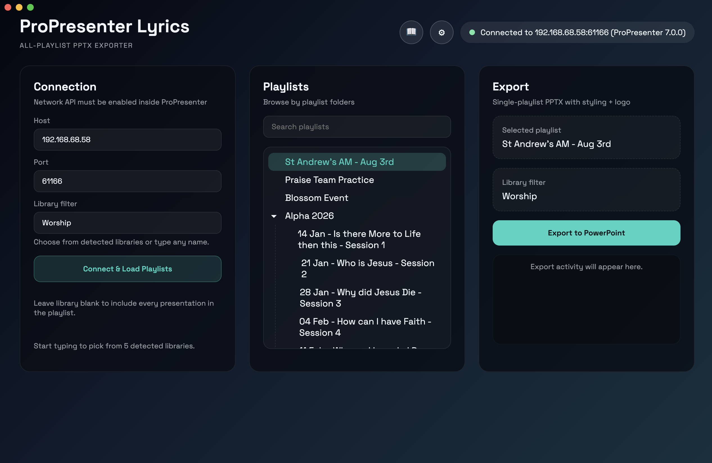

# User Guide

[← Back to Home](./index.md) | [Getting Started](./getting-started)

---

Complete guide to exporting lyrics from ProPresenter playlists.

## Table of Contents

1. [What This Tool Does](#what-does-this-tool-do)
2. [Desktop App Guide](#desktop-app-guide)
   - [First Launch](#first-launch)
   - [Library Filter](#library-filter)
   - [PPTX Settings](#pptx-export-settings)
   - [Export Process](#export-process-lyrics-export)
3. [CLI Guide](#cli-guide)
4. [Need Help?](#need-help)

## What Does This Tool Do?

ProPresenter Lyrics Export extracts song lyrics from your ProPresenter presentations and exports them to:
- **PowerPoint** - Formatted slides ready for projection or printing
- **Text** - Plain text format for lyric sheets or setlists
- **JSON** - Structured data for custom integrations

**Common use cases:**
- Create lyric slides for overflow rooms or online streaming
- Generate printed lyric sheets for worship team
- Export setlists for archival or planning
- Create PowerPoint backups of your worship library

### Watch It in Action

See the song lyrics export feature demonstrated in this quick video:

<iframe width="560" height="315" src="https://www.youtube.com/embed/6fKM3rUmUQI" title="ProPresenter Lyrics Export Demo" frameborder="0" allow="accelerometer; autoplay; clipboard-write; encrypted-media; gyroscope; picture-in-picture; web-share" allowfullscreen></iframe>

---

## Desktop App Guide

### Before You Start

**⚠️ ProPresenter MUST be configured first!**

If you haven't already, you need to enable ProPresenter's Network API. See the [Getting Started guide](./getting-started#critical-configure-propresenter-first) for detailed instructions.

**Quick checklist:**
- [ ] ProPresenter 7 is running
- [ ] Network API is enabled (Preferences → Network)
- [ ] You know the host IP and port (usually `127.0.0.1:1025`)

### First Launch

1. **Connect to ProPresenter**
   - Enter your ProPresenter **host** (e.g., `127.0.0.1`)
   - Enter your ProPresenter **port** (default: `1025`)
   - Click **"Connect & Load Playlists"**
   - The app will detect your ProPresenter version and load all playlists

2. **Select a Playlist**
   - Browse the playlist tree (all folders are expanded by default)
   - Search for playlists using the search box
   - Click a playlist name to select it
   - The breadcrumb path shows your selection



### Library Filter

**What it does:** Only exports songs from a specific library (e.g., "Worship").

- Leave blank to include all presentations in the playlist
- Type a library name to filter by that library
- The app shows detected libraries as you type

### PPTX Export Settings

Open the **⚙ Settings** button to customize your PowerPoint exports:

#### Basic Options
- **Include song title slides** - Toggle to show/hide title slides before lyrics
- **Font family** - Choose from 25+ curated presentation fonts
  - Green ✓ = installed on your system
  - Gray ○ = missing (click to download from Google Fonts)
  - Click **Refresh** after installing new fonts

#### Text Styling
- **Text color** - RGB color picker for lyric text
- **Font size** - Lyric text size (default: 44pt)
- **Title size** - Song title size (default: 54pt)
- **Bold** / **Italic** - Text formatting toggles

#### Logo
- **Logo path** - Optional logo image to include on title slides
- Click to browse for `.png` or `.jpg` files
- Logo is resized proportionally to fit the slide

### Export Process (Lyrics Export)

**What happens during export:**
1. The tool fetches all presentations from your selected playlist
2. For each presentation, it extracts lyrics from the slides
3. Lyrics are organized by section (Verse 1, Chorus, Bridge, etc.)
4. A PowerPoint file is generated with formatted slides for each song
5. The file is saved to your chosen location

**Steps to export:**
1. **Select a playlist** from the tree
2. **Set library filter** (optional) - Only export songs from "Worship" library
3. **Adjust PPTX settings** if needed (fonts, colors, logo)
4. Click **"Export to PowerPoint"**
5. Choose save location and filename
6. Processing begins (progress shown in log below)
7. File is saved when complete

**What you get:** A PowerPoint file with:
- One section per song
- Title slide for each song (optional)
- Lyrics organized by verse/chorus/bridge
- Your custom styling and formatting

**Log View:** Shows real-time export progress and any issues encountered.

### Nested Playlists

The app automatically expands all nested playlist folders so you can easily see and select playlists at any depth. You can collapse folders by clicking the arrow (▸) if you prefer a condensed view.

---

## Need Help?

- 📖 See the [FAQ](./faq) for troubleshooting
- 🎨 Want to customize your exports? Check the [PPTX Export Guide](./guides/pptx-export)
- 💻 Using CLI? See the [CLI Command Reference](./guides/cli-guide)
- 🔄 Want to automate? Try the [Service Generator Guide](./guides/service-generator) (advanced)

### Basic Commands

#### Check Connection
```bash
propresenter-lyrics status
```
Shows ProPresenter version and current presentation info.

#### List Playlists
```bash
propresenter-lyrics playlists
```
Display all playlists with their UUIDs and paths.

#### List Libraries
```bash
propresenter-lyrics libraries
```
Show all available libraries in ProPresenter.

#### Get Current Presentation
```bash
propresenter-lyrics current
```
Show details of the currently active presentation.

#### Get Focused Presentation
```bash
propresenter-lyrics focused
```
Show the presentation with focus in ProPresenter.

### Export Commands

#### Interactive Export (Text)
```bash
propresenter-lyrics export
```
Select a playlist interactively, then export all lyrics as text.

**Direct mode:**
```bash
propresenter-lyrics export <playlist-uuid>
```

**JSON output:**
```bash
propresenter-lyrics export --json
propresenter-lyrics export <playlist-uuid> --json
```

#### Export to PowerPoint
```bash
propresenter-lyrics pptx
```
Interactive mode - select playlist and output filename.

**Direct mode:**
```bash
propresenter-lyrics pptx <playlist-uuid> output-filename
```

#### Watch for Changes
```bash
propresenter-lyrics watch
```
Monitor presentation in real-time and display changes as they happen.

### Options

Add these flags to any command:

```bash
--host, -h <host>      ProPresenter host (default: 127.0.0.1)
--port, -p <port>      ProPresenter port (default: 1025)
--json, -j             Output as JSON instead of text
--debug, -d            Show raw API responses
--help                 Show command help
```

### Examples

```bash
# Check connection to remote ProPresenter
propresenter-lyrics status --host 192.168.1.100 --port 61166

# Export specific playlist to JSON
propresenter-lyrics export abc123-def456 --json

# Export PowerPoint with custom host
propresenter-lyrics pptx --host 192.168.1.100 my-service-pptx

# Watch live with debug output
propresenter-lyrics watch --debug
```

### Environment Variables

Avoid typing host/port every time:

```bash
export PROPRESENTER_HOST=192.168.1.100
export PROPRESENTER_PORT=1025
propresenter-lyrics status  # Uses env vars
```

---

## Connection Settings

### Finding Your Host and Port

**Local Machine:**
- Host: `127.0.0.1` or `localhost`
- Port: Usually `1025` (check ProPresenter preferences)

**Remote Machine:**
- Host: IP address of the ProPresenter computer (e.g., `192.168.1.100`)
- Port: ProPresenter's Network API port

### How to Find ProPresenter Settings

1. Open ProPresenter 7
2. Go to **Preferences** → **Network**
3. Look for:
   - **Enable Network API** checkbox (must be enabled)
   - **Port** field (note this number)
   - **Host IP** (if remote, find this on the ProPresenter computer)

### Network Firewall

If connecting to a remote ProPresenter:
- Ensure the network allows traffic on the ProPresenter port
- The port must be open on the ProPresenter computer's firewall
- ProPresenter must be running

---

## Troubleshooting

### Connection Issues

**"Connection refused" or "Network error"**
1. Verify ProPresenter is running
2. Check Network API is enabled (Preferences → Network)
3. Verify host and port are correct
4. Try from the ProPresenter computer first (use `127.0.0.1`)

**"Connection timed out"**
1. Check firewall rules
2. Verify the ProPresenter IP address is correct
3. Ensure the port is open
4. Try `status` command with `--debug` flag for more info

### Export Issues

**PowerPoint file is empty or has missing lyrics**
1. Verify the playlist contains presentations
2. Check that the library filter matches your songs
3. Try with no library filter (leave blank) to see all items

**Font not appearing in exported PPTX**
1. Ensure the font is installed on the system where PPTX will be opened
2. Use a system font (Arial, Helvetica, etc.) for guaranteed compatibility
3. Check the font dropdown to see installation status

### macOS Issues

**"App is damaged and can't be opened"**
```bash
xattr -cr "/path/to/ProPresenter Lyrics.app"
```

**App won't launch**
- Try right-click → Open (instead of double-click)
- Check System Preferences → Security for app permissions

### Windows Issues

**"Windows protected your PC"**
1. Click "More info"
2. Click "Run anyway"
3. Grant administrator permissions if prompted

**Command not recognized**
- Ensure the executable is in your PATH
- Use full path: `C:\Tools\propresenter-lyrics-win-x64.exe status`

---

## Tips & Tricks

### Batch Processing
Use the CLI to automate exports:

```bash
#!/bin/bash
for uuid in abc123 def456 ghi789; do
  propresenter-lyrics pptx "$uuid" "output-$uuid"
done
```

### Custom Font Setup
1. Download fonts from Google Fonts
2. Install on your system
3. Use the font dropdown in settings
4. Click "Refresh" after installation

### PPTX Styling
- **Dark slides:** Use light text colors (white, light gray)
- **Light slides:** Use dark text colors (black, dark gray)
- **Readability:** Keep font sizes 40pt+ for audience visibility
- **Branding:** Add your logo on title slides for consistency

### Remote ProPresenter
For a computer on your network:
1. Find its IP (Windows: `ipconfig`, macOS: `ifconfig`)
2. Enable Network API on that computer
3. Connect from another machine using that IP and port
4. Ensure network allows the connection
